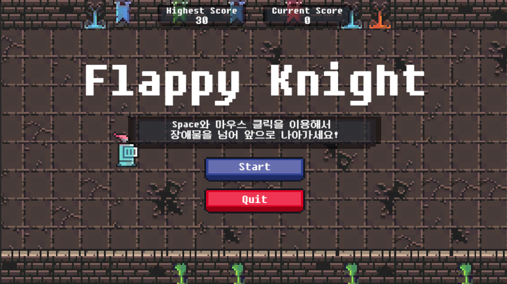
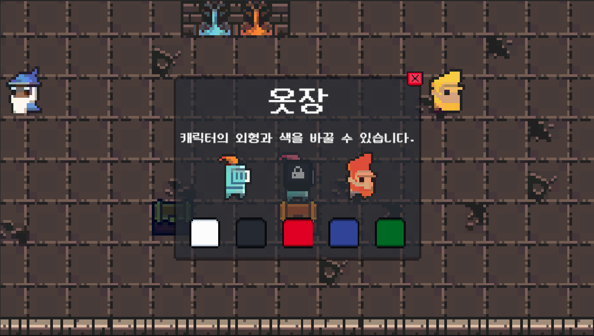
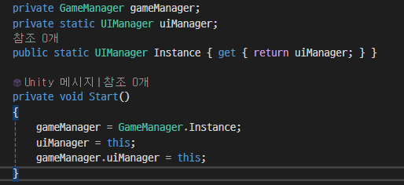

# 스파르타 픽셀버스 SpartaPixelVerse
스파르타 내일배움캠프에서 Unity 입문 개인 과제로 진행한 개인 프로젝트입니다.

  
----
  
## 📌 프로젝트 개요
  
- **프로젝트**: SpartaPixelVerse
- **개발환경**: Unity, C#
- **개발기간**: 25.02.17 - 25.02.20 (예정)
- **개발인원**: 손치완
- **타임라인**:  
  🔹25.02.17 (월) 프로젝트 시작.  
  🔹25.02.19 (수) SpartaPixelVerse v0.1
  🔹25.02.20 (목) SpartaPixelVerse v0.2
- **주요기능**:  
  캐릭터 이동, 오브젝트 상호작용, UI 표시, 게임 결과 저장 및 표시, NPC 대화, 플레이어 장식물 구현 등  
  
----
  
## 🎮 게임 설명
SpartaPixelVerse는 간단한 메타버스 환경을 구축하고, 맵 위의 다양한 오브젝트와 상호작용하는 방법을 습득하기 위해 제작되었습니다.
플레이어는 맵 내의 여러 오브젝트와 상호작용하고, 다양한 미니게임을 즐길 수 있으며, 미니게임의 결과가 게임 내에 저장되기 때문에 언제든지 확인할 수 있습니다.  
  
----

## 🛠️ 게임 기능
#### 1️⃣ 메타버스 구성
- 메타버스 맵을 구성하고, 오브젝트를 배치했으며, 플레이어의 방향키 혹은 WASD 입력을 받아 플레이어의 캐릭터가 이동할 수 있도록 했다.
  
#### 2️⃣ 미니게임 이식
- 기존에 제작했었던 Flappy plane을 프로젝트의 전체 컨셉에 맞게 변경하여 이식했다.
- 미니 게임 내의 UI를 통해 현재 점수와 최고 점수를 확인할 수 있도록 제작했다.

  
#### 3️⃣ 씬 전환
- 미니 게임이 종료된 이후, 메타버스 맵으로 돌아와 미니 게임의 점수를 확인할 수 있도록 했다.
  
#### 4️⃣ 카메라 추적 기능
- 플레이어의 이동에 따라 카메라가 함께 이동하도록 했다.
- 카메라가 맵의 일정 범위 밖을 보여주지 않도록 제한을 두었다.
- 하나의 코드로 메타버스 맵과 미니 게임에서의 카메라 추적이 가능하도록 했다.

----
#### 5️⃣ 캐릭터 커스텀
- 캐릭터의 색과 외형을 변경할 수 있는 오브젝트와 UI를 구성했다.
- 캐릭터의 `SpriteRendere`에 색을 입혀, 캐릭터의 색을 변경할 수 있다.
- 캐릭터의 애니메이션에 `IsDwarf` 변수를 추가해, 변수 값에 따라 다른 캐릭터 외형의 애니메이션이 실행되도록 했다.

  
#### 6️⃣ 리더보드 시스템
- 미니게임의 점수를 확인할 수 있는 리더보드 UI를 구성했고, 게임 내 오브젝트를 통해 이를 확인할 수 있도록 했다.

#### 7️⃣ 펫 시스템
- 캐릭터의 머리 위에 생성돼, 캐릭터의 이동 속도를 빠르게 해주는 펫 시스템을 구현했다.
- 탈것의 에셋이 없었기 때문에, 탈것 대신에 펫으로 구현했다.
- 오브젝트와의 상호작용을 통해 펫을 장착하거나 해제할 수 있으며, 펫이 장착되었는지 여부는 `GameManger`의 `IsPet` 변수에 저장되어 각 스크립트에서 활용된다.

#### 8️⃣ NPC 대화 기능
- 드워프 NPC와의 상호작용을 통해 간단한 대화를 진행하고, 미니게임을 실행하도록 구성했다.
  
----

## 🚀 트러블슈팅 (문제해결)
#### 1️⃣ 미니 게임의 인트로 화면 표시
- **문제**: 미니 게임을 진행할 수 있는 씬으로 전환한 이후, 미니 게임에 대한 설명이 담긴 인트로 화면을 표시할 예정이었다. 인트로 화면으로 표시할 UI는 구현을 했으나, 게임이 먼저 시작하고 게임이 시작한 이후에도 UI가 사라지지 않았다.
- **원인**: 게임이 시작했는지를 확인하는 로직이 없기 때문에 게임이 자기 멋대로 시작하는 것이며, 또한 해당 로직이 없기 때문에 UI를 껐다 켰다 할 수 있는 기능을 활용할 수 없었다.
- **해결**: 게임이 시작했는지를 확인하는 변수, `isStart`를 선언해 게임이 시작했는지 아닌지를 확인하도록 했다. 또한, 게임이 시작되지 않았을 경우에는 `Rigidbody2D`의 `position`이 변화하지 않도록 제한을 걸어 두었다. (이후 게임이 시작하면 제한을 해제했다.)

#### 2️⃣ 씬 전환에 따른 오브젝트 재생성/재할당
- **문제**: `MainScene`에서 활용하기 위해 `GameManager` 및 `UIManager` 클래스를 싱글톤 처리를 했고, `GameManager`의 경우에는 씬을 전환해도 파괴되지 않도록 했다. 그러나 씬을 전환해 다시 `MainScene`에 진입했을 때, `UIManager`에 대한 `NullReference` 오류가 발생했다.
- **원인**: 씬을 전환하면 `DontDestroyOnLoad` 처리 되지 않은 오브젝트는 모두 삭제된다. 때문에, 다시 `MainScene`에 진입했을 때 `UIManager` 오브젝트가 다시 생성되었고, 이것이 `GameManager`에 재할당되지 않아 `NullReference` 오류가 발생했다.
- **해결**: `GameManager` 내에서 사용될 `UIManager`를 `public` 인스턴스로 선언한 뒤, 씬이 전환된 이후에도 다시 이를 할당 받을 수 있도록 `UIManager`의 `Start()` 로직을 변경했다.

#### 3️⃣ NPC 대화 선택지 구성
- **문제**: NPC와 대화하기 위한 UI를 구성하는 데 있어서, 서로 다른 텍스트를 표시하도록 하는 것과 서로 다른 선택지를 제공하는 것 등의 여러 기능을 구현하는데 어려움을 겪었다.
- **해결**: 🔵 먼저, NPC의 텍스트를 리스트로 작성해, 유저의 입력(예: Spacebar)을 받아 다음 텍스트를 출력하도록 코드를 작성했다. 🔵 유저에게 선택지를 제공하는 텍스트를 출력할 때는 별도의 입력을 받을 수 있도록 코드를 분리했으나, 아직 유저의 새로운 입력을 받지 못하기 때문에 임시적으로 Spacebar로 미니게임으로 넘어가도록 했다.
